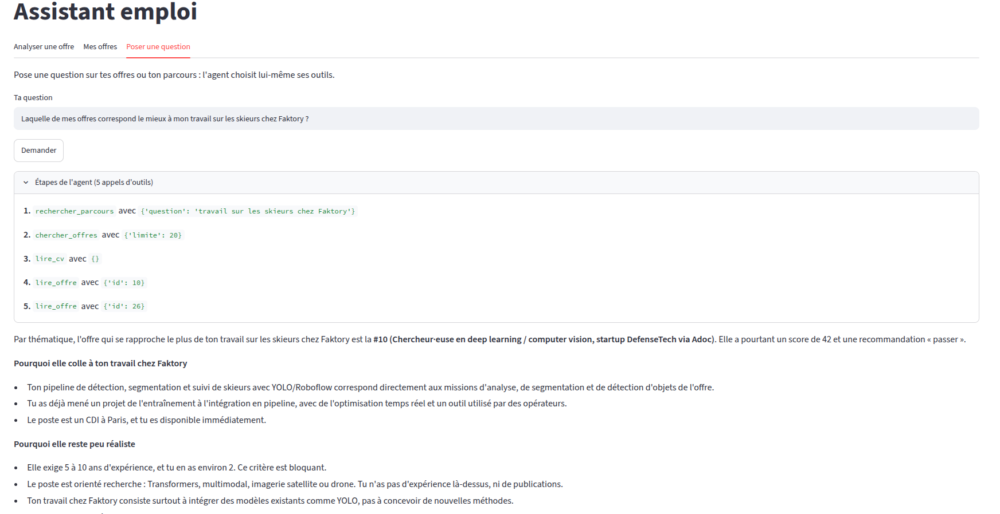

# Assistant emploi — analyse d'offres et agent IA (RAG + LLM)

Un assistant qui m'aide à cibler ma recherche d'emploi :
- **Analyser une offre** : score d'adéquation, points forts prouvés par mon parcours, manques, exigences bloquantes et recommandation (postuler, postuler en adaptant ou passer).
- **Suivre mes offres** : toutes les analyses enregistrées, triées par score.
- **Poser une question à un agent** : il choisit lui-même ses outils (SQL sur mes offres, RAG sur mon parcours, lecture du CV) pour répondre, par exemple, à « laquelle de mes offres correspond le mieux à mon travail chez Faktory ? ».



## Résultats de l'évaluation

Jeu de test de 10 offres réelles (2 hors sujet, 4 pièges avec une exigence éliminatoire, 2 moyennes ou limites, 2 bonnes), avec les attentes écrites **avant** de lancer l'outil.

| Mesure | Résultat |
|---|---|
| Rappel de la recherche (sources attendues retrouvées dans le top 5) | 95 % (sur 7 offres) |
| Exigences bloquantes, itération 1 : définition précise + règle « bloquante, donc passer » | 6/9 → **9/9** |
| Exigences bloquantes, itération 2 : tolérance d'un an sur l'expérience + cas limite dédié | 9/10 → **10/10**, sans régression |
| Recommandation et score dans les valeurs attendues | **10/10** |

Méthode : chaque version est comparée à une référence mesurée **avec la même règle** (un script recorrige les anciennes réponses enregistrées, sans rappeler le LLM). Une seule chose change à la fois, et les cas qui marchaient doivent continuer à marcher (non-régression).

Observations :
- La variabilité dépend de l'ambiguïté : une offre hors sujet varie de 3 à 8 points sur 7 analyses, une offre limite jusqu'à 14 points. D'où des fourchettes de score plutôt que des valeurs exactes.
- Une offre au texte tronqué obtenait 62 au lieu de 42 : les exigences, en fin d'offre, manquaient. L'outil n'est pas plus juste que ce qu'on lui donne à lire.

Limites : un seul lancement par version, et un prompt réglé sur ces offres. Un second jeu d'offres jamais vu reste à construire.

## Architecture

```
Streamlit (3 onglets)
      │  HTTP
      ▼
FastAPI : /offres (GET, POST, DELETE) · /agent (POST)
      │
      ├── Analyse (workflow) ──► Claude, sortie validée par un schéma Pydantic
      │        └── Recherche RAG ──► PostgreSQL + pgvector
      │
      └── Agent ──► Claude + 4 outils
               ├── chercher_offres    (SQL, paramètres fixes)
               ├── lire_offre         (SQL, par id)
               ├── rechercher_parcours (RAG)
               └── lire_cv            (CV complet)
```

- **Ingestion** : les fichiers de parcours sont découpés en chunks (paragraphes, puis lignes, puis phrases, avec chevauchement) et vectorisés avec `multilingual-e5-base` (768 dimensions).
- **Recherche** : similarité cosinus dans pgvector, 5 passages, au plus 2 par source pour garder de la diversité.
- **Analyse** : un workflow (un seul appel, chemin fixé par le code), avec règles d'honnêteté (« non précisé » plutôt qu'inventer) et de protection contre l'injection de prompt.
- **Agent** : Claude choisit ses outils, lit les résultats et décide de la suite. Il n'a aucun outil intégré (pas de terminal, pas de fichiers) : seulement 4 outils à paramètres fixes, c'est le code qui écrit les requêtes SQL. Il relance au plus deux recherches si une information manque.
- **Anti-doublons** : une empreinte md5 du texte, unique en base. L'API vérifie avant d'appeler Claude et renvoie une 409 : une offre déjà connue répond en environ 40 ms au lieu de 28 s.
- **Erreurs** : 404 si une offre n'existe pas, 409 si elle existe déjà, 502 si Claude échoue, sans faire planter l'API ni l'interface.


## Serveur MCP

Les 4 outils de l'agent sont aussi exposés par un serveur MCP autonome (`mcp_server.py`), utilisable par n'importe quel client MCP. La logique des outils est écrite une seule fois dans `outils.py`, puis emballée par l'agent et par le serveur.

```bash
claude mcp add --scope user emploi -- /chemin/vers/.venv/bin/python /chemin/vers/mcp_server.py
claude mcp list   # emploi : ✔ Connected
```


## Choix techniques

- **pgvector plutôt qu'une base vectorielle dédiée** : une seule base pour les données et les vecteurs, gratuite et locale.
- **CV entier, projets en RAG** : on ne met en RAG que ce qui ne tient pas dans le prompt. Découpé, le CV n'était vu qu'en partie.
- **Sortie structurée validée** : une consigne dans le prompt ne garantit pas le format ; un schéma, si.
- **L'interface passe toujours par l'API** : Streamlit ne fait qu'afficher, toute la logique est derrière l'API.

## Lancer le projet

Prérequis : Python 3.12, Docker, et Claude Code installé et connecté (utilisé par le Claude Agent SDK).

```bash
git clone https://github.com/evanbokobza-pixel/assistant-emploi.git
cd assistant-emploi
python3 -m venv .venv && source .venv/bin/activate
pip install -r requirements.txt

cp .env.example .env               # puis remplir les valeurs
docker compose up -d               # PostgreSQL + pgvector
docker compose exec -T db sh -c 'psql -U "$POSTGRES_USER" -d "$POSTGRES_DB"' < schema.sql

python ajouter_preferences.py      # préférences de recherche
python ingestion.py                # découpage + embeddings du parcours
```

Puis, dans deux terminaux :

```bash
uvicorn main:app --reload --reload-exclude app.py   # API : http://localhost:8000/docs
streamlit run app.py                                 # interface : http://localhost:8501
```

## Évaluations

```bash
python evals/eval_recherche.py                        # rappel de la recherche (sans appel au LLM)
python evals/eval_analyse.py                          # score, recommandation, exigences bloquantes
python evals/recorriger.py evals/resultats/<fichier>  # recorrige d'anciennes réponses avec la règle actuelle
```

Les attentes sont dans `evals/attentes.json`. Chaque lancement de l'eval d'analyse enregistre toutes les réponses dans `evals/resultats/`.

## Pistes

- Mesurer la stabilité (plusieurs lancements) et tester sur un second jeu d'offres jamais vu.
- Mesurer la précision de la recherche et ajouter un seuil de pertinence.
- Avertir quand le texte d'une offre semble tronqué.
- Suivi des candidatures (la table existe, l'interface reste à faire).
- Serveur MCP autonome, puis déploiement cloud.

## Stack

Python · Claude (Claude Agent SDK) · PostgreSQL · pgvector · sentence-transformers · FastAPI · Pydantic · Streamlit · Docker Compose
