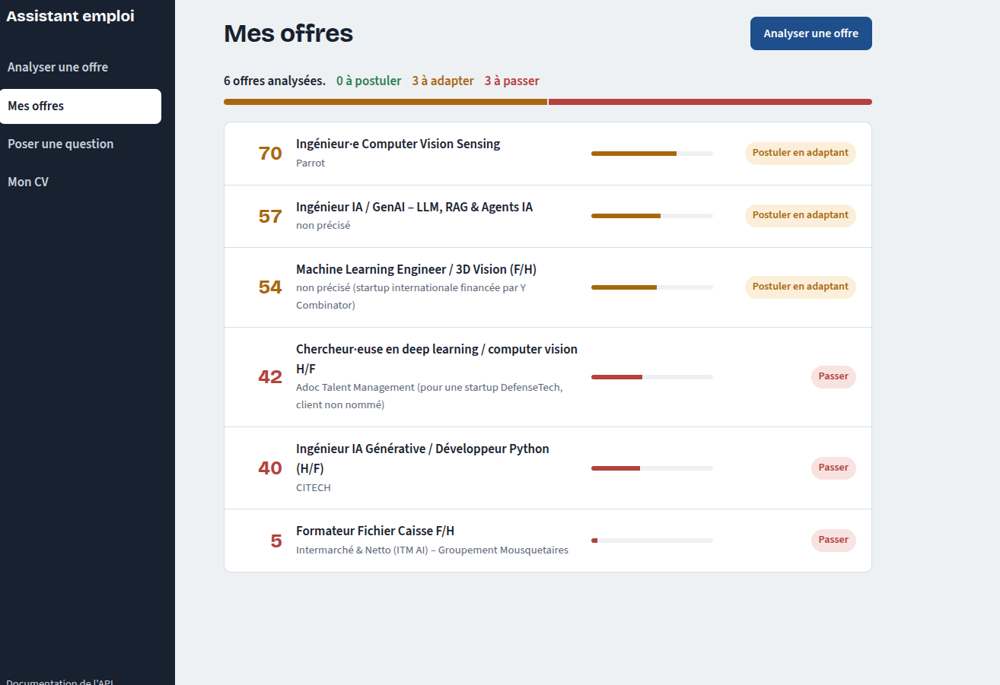

# Assistant emploi — RAG, agent et serveur MCP


Un assistant qui analyse une offre d'emploi par rapport à mon parcours : score d'adéquation, points forts avec leur preuve, manques, exigences bloquantes et recommandation (postuler, postuler en adaptant ou passer). Un agent répond aux questions sur mes offres et mon parcours en choisissant lui-même ses outils.



## Fonctionnalités

- **Analyser une offre** : recherche vectorielle (RAG) dans mon parcours, puis analyse par Claude avec une sortie validée par un schéma Pydantic.
- **Mes offres** : offres classées par score, avec la répartition des recommandations.
- **Poser une question** : un agent Claude choisit entre 4 outils (offres en SQL, parcours en RAG, détail d'une offre, CV complet) et affiche les outils qu'il a utilisés.
- **Mon CV** : le CV se modifie depuis le site et sert dès l'analyse suivante.
- **Serveur MCP** : les mêmes outils sont utilisables depuis Claude Code.

## Résultats de l'évaluation

Jeu de test de 10 offres réelles (hors sujet, pièges avec une exigence éliminatoire, moyennes, bonnes), avec les attentes écrites avant de lancer l'outil.

| Mesure | Résultat |
|---|---|
| Rappel de la recherche (sources attendues dans le top 5) | 95 % |
| Exigences bloquantes correctement détectées | 6/9 → 9/9 → **10/10** |
| Recommandation dans les valeurs acceptées | **10/10** |
| Score dans la fourchette attendue | **9/10** (dernier lancement) |

Ce qui a fait progresser l'outil :
- **6/9 → 9/9** : une définition précise de l'« exigence bloquante » dans le prompt. La référence a été mesurée avec le même critère strict ; seul le prompt a changé.
- **9/10 → 10/10** sur une 10ᵉ offre : une tolérance d'un an sur l'expérience demandée (un écart d'un an est un manque, pas un motif d'élimination).

Limites : les scores varient de quelques points d'un lancement à l'autre (jusqu'à environ 10 points sur une offre ambiguë), et le prompt a été réglé sur ces offres ; un jeu de test séparé reste à construire.

## Architecture

```
Navigateur (HTML / CSS / JavaScript)
      │  HTTP
      ▼
FastAPI : site statique + API REST (/offres, /agent, /cv)
      │
      ├──► Analyse ──► Recherche RAG ──► PostgreSQL + pgvector
      │       │                          (offres, analyses, chunks + embeddings)
      │       ▼
      │    Claude (sortie validée par Pydantic)
      │
      └──► Agent Claude ──► 4 outils (SQL, RAG, détail d'offre, CV)
                                 ▲
                   Serveur MCP ──┘ (mêmes outils, pour Claude Code)
```

- **Ingestion** : les fichiers du parcours sont découpés en chunks (paragraphes, puis lignes, puis phrases, avec chevauchement) et transformés en vecteurs de 768 dimensions avec `multilingual-e5-base`.
- **Recherche** : similarité cosinus dans pgvector, 5 passages retenus avec au plus 2 par source pour garder de la diversité. Le CV, court, est envoyé en entier.
- **Analyse** : prompt structuré en balises XML, règle « non précisé plutôt qu'inventer », protection contre l'injection de prompt. Le SDK relance Claude si la réponse ne respecte pas le schéma.
- **API** : 409 si l'offre a déjà été analysée (empreinte md5 unique en base, détectée avant tout appel à Claude), 502 si Claude échoue, 422 si la requête est invalide.

## Choix techniques

- **pgvector plutôt qu'une base vectorielle dédiée** : une seule base pour les données et les vecteurs, gratuite et locale.
- **CV entier dans le prompt, projets en RAG** : on ne met en RAG que ce qui ne tient pas dans le prompt. Avec le CV découpé, Claude n'en voyait qu'une partie et se trompait sur le type de contrat.
- **Sortie structurée validée** : une consigne dans le prompt ne garantit pas le format ; la validation par schéma, si.
- **Agent au pouvoir minimal** : aucun outil intégré (ni shell ni fichiers), des paramètres fixés à l'avance plutôt que du SQL libre, une limite de 20 résultats et de 12 tours.
- **Site en HTML/CSS/JavaScript servi par FastAPI** : une seule adresse et un seul processus, sans framework ni étape de compilation. Tout texte venant de l'extérieur est échappé avant affichage (protection XSS).
- **Modèle d'embeddings chargé au premier usage** : les tests et l'API démarrent sans le charger.

## Lancer le projet

Prérequis : Docker, et un accès à Claude (jeton d'abonnement ou clé API).

```bash
git clone https://github.com/evanbokobza-pixel/assistant-emploi.git
cd assistant-emploi
cp .env.example .env      # puis remplir le mot de passe et UNE authentification Claude
docker compose up --build
```

Le site est sur http://localhost:8000 et la documentation de l'API sur http://localhost:8000/docs.

Au premier lancement seulement, dans un second terminal :

```bash
docker compose exec app python ajouter_preferences.py   # préférences de recherche
docker compose exec app python ingestion.py             # découpage + embeddings du parcours
```

Pour l'authentification Claude, `.env` contient soit `CLAUDE_CODE_OAUTH_TOKEN` (jeton d'un abonnement personnel, généré par `claude setup-token`), soit `ANTHROPIC_API_KEY` (clé de la Claude Console).

## Tests et CI

```bash
pytest -v        # 19 tests, sans appel à Claude ni base de données
ruff check .
```

Les tests couvrent le découpage en chunks (taille, chevauchement, aucune perte), le schéma de validation (score hors bornes, recommandation inconnue, champ manquant) et les routes du CV (sauvegarde, refus d'un CV trop court).

À chaque push, GitHub Actions lance ruff, les tests et la construction de l'image Docker.

## Évaluations

```bash
python evals/eval_recherche.py     # rappel de la recherche (sans appel à Claude)
python evals/eval_analyse.py       # score, recommandation, exigences bloquantes
```

Les attentes sont dans `evals/attentes.json`. Chaque lancement enregistre toutes les réponses dans `evals/resultats/`, pour comparer deux versions du prompt sans relancer Claude.

## Serveur MCP

`mcp_server.py` expose les 4 outils de l'agent selon le protocole MCP (transport stdio). Pour l'utiliser depuis Claude Code :

```bash
claude mcp add --scope user emploi -- /chemin/vers/.venv/bin/python /chemin/vers/mcp_server.py
```

## Pistes

- Mesurer la stabilité sur plusieurs lancements et tester sur un second jeu d'offres jamais vu.
- Mettre à jour la recherche RAG automatiquement quand le CV est modifié depuis le site.
- Déploiement en ligne, avec une clé API plafonnée.

## Stack

Python · Claude (Claude Agent SDK) · MCP · PostgreSQL · pgvector · sentence-transformers · FastAPI · Pydantic · HTML / CSS / JavaScript · Docker Compose · pytest · ruff · GitHub Actions
